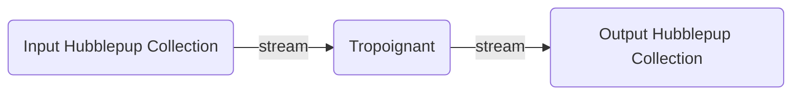
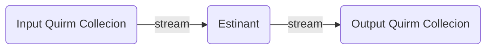
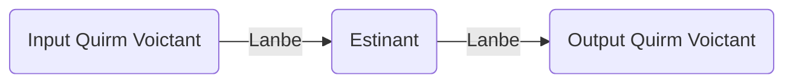
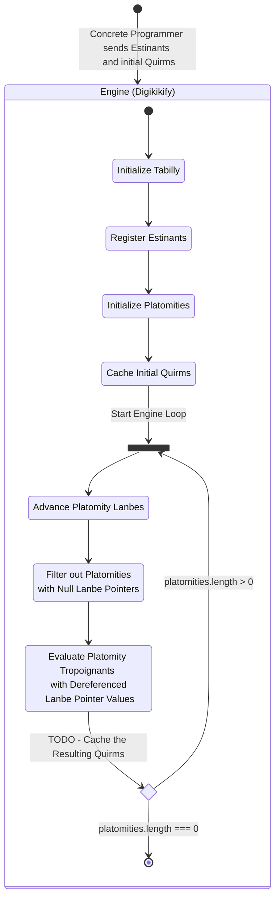
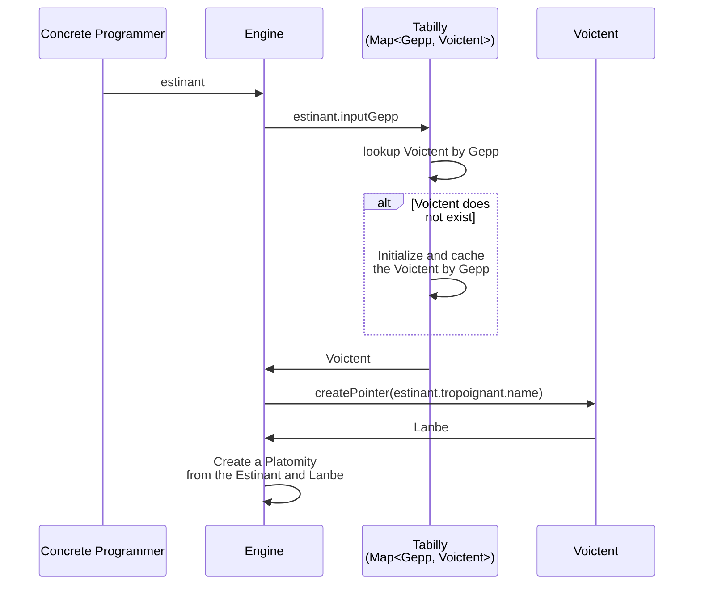
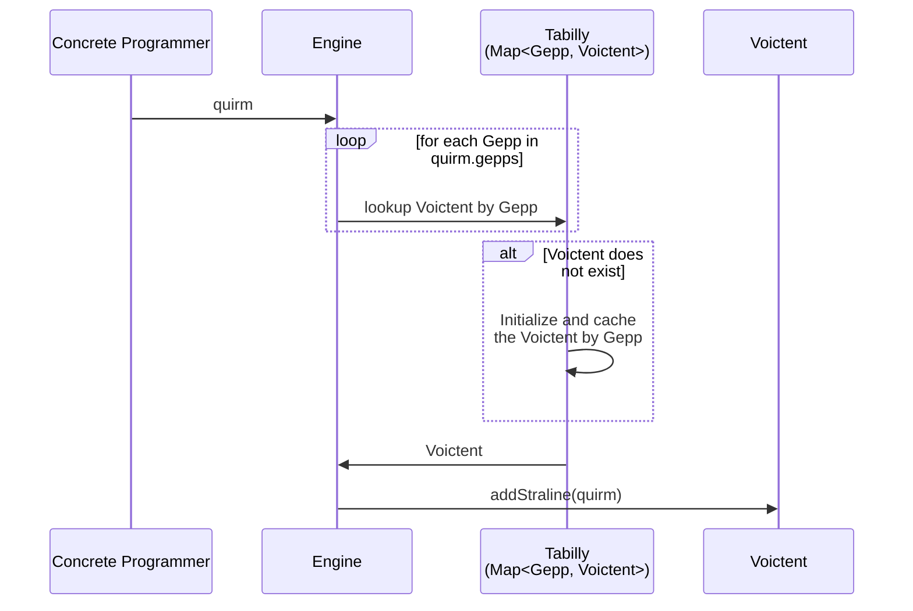

# Open Schema Type Script

An Open Schema implementation that is used to iterate on the Open Schema specification.

**note**: As of 2023-02-05, this implementation is a better source of truth of the Open Schema specification rather than
[open-schema.org](https://open-schema.org). This is subject to change.

## Quick Example

```bash
# All commands are from the root of the monorepo

# One time install
npm ci

# Run the Open Schema example(s): They will output files that contain engine event information
npx ts-node packages/open-schema-type-script/src/example/exampleCore.ts
npx ts-node packages/open-schema-type-script/src/example/exampleAdapter.ts
npx ts-node packages/open-schema-type-script/src/example/exampleCustom.ts
```

## Terminology

For additional terminology see the source files of the core engine in [src/core](./src/core/), as well as the
[diagrams](#diagrams) below.

### Engine

The Open Schema runtime environment.

### Programmer

Someone or something that inputs information into an Open Schema engine.

#### Concrete Programmer

Someone or something that inputs information directly into an Open Schema engine.

#### Abstract Programmer

Someone or something that inputs information indirectly into an Open Schema engine. For example, a Concrete Programmer
can create adapter utilities to an Open Schema engine to make it easier for an Abstract Programmer to model their
problems and solutions.

## Folder Structure

### src/core

The core implementation of `open-schema` written in TypeScript, but decoupled from TypeScript semantics.

### src/example

An example program for demonstrating the behavior of the `open-schema` engine.

## Diagrams

TODO: Generate these digrams from the code base

### Abstract Concrete Programmer Concerns

A Concrete Programmer wants to process some data (Hubblepups), and they want to define how that data is processed (Tropoignants).
Therefore they can define a collection of Hubblepups and a Tropoignant to proccess that collection via a stream.



### Abstract Programmable Units

The Concrete Programmer programs the Engine by defining Quirms (wrappers on Hubblepups), and Estinants (wrappers on Tropoignants)



### Abstract Engine Concerns



#### Voictents and the Tabilly

- A Voictent is a collection of anything (Stralines)
- The Engine has a Tabilly which is an index of Voictents by Gepp

#### Gepps

- A Gepp allows the Engine to find a Voictent for various needs
  - A Quirm contains multiple Gepps and a Hubblepup
  - An Estinant contains a Gepp and a Tropoignant
- Quirms allow the Engine to add a Hubblepup to multiple Voictents based on the Quirm's Gepps
- Estinants allow the Engine to feed a Voictent into a Tropoignant based on the Estinant's Gepp

#### Lanbes

- A Voictent can have multiple pointers to various entities in the collection
- A Lanbe is an abstraction of one of these pointers and its operations, which allows it to stream entities to and from Voictents

#### Platomities

- The Engine uses Platomities (collections of Estinants and Lanbes) to feed Quirms into Estinants, and subsequently,
  Hubblepups into Tropoignants
- The Engine uses the Platomity's Lanbe to keep track of which Quirm to process next
- The Engine is done processing a Platomity when the Lanbe reaches the end of the Voictent
  - **Note**: This behavior is subject to change as I iterate on the Engine

### The Concrete Programmer and the Engine



### Registering an Estinant and Initializing a Platomity



### Caching an Initial Quirm


